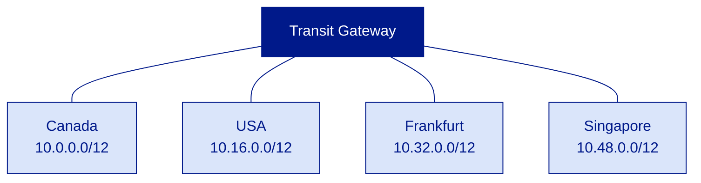

# Global Network Design

```mermaid
%%{init: {'theme': 'base', 'themeVariables': { 'primaryColor': '#00198a', 'primaryTextColor': '#ffffff', 'primaryBorderColor': '#00198a', 'lineColor': '#00198a', 'secondaryColor': '#dae5fa', 'tertiaryColor': '#ffffff'}}}%%
flowchart TB
    TGW[Transit Gateway]

    CA[Canada<br>10.0.0.0/12]
    US[USA<br>10.16.0.0/12]
    DE[Frankfurt<br>10.32.0.0/12]
    SG[Singapore<br>10.48.0.0/12]

    TGW --- CA
    TGW --- US
    TGW --- DE
    TGW --- SG

    style TGW fill:#00198a,stroke:#00198a,color:#ffffff
    style CA fill:#dae5fa,stroke:#00198a,color:#00198a
    style US fill:#dae5fa,stroke:#00198a,color:#00198a
    style DE fill:#dae5fa,stroke:#00198a,color:#00198a
    style SG fill:#dae5fa,stroke:#00198a,color:#00198a
```

## Key Components

- Transit Gateway connects all 4 regions
- Each region has a /12 block (1M+ IPs)
- No CIDR overlaps between regions

Author: Ditah Kumbong
